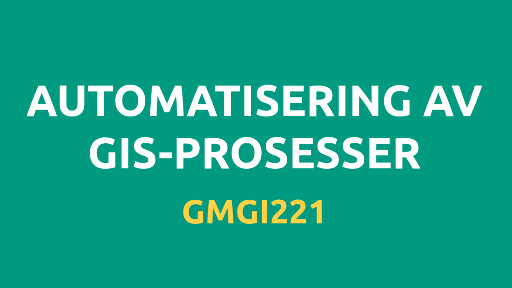

# Velkommen til GMGI221 

Velkommen til nettsiden for GMGI221 - Automatisering av GIS-prosesser ved NMBU høsten 2024.
Emnet gir en innføring i programmering for geografiske analyser og programmatisk behandling av geografiske data. Gjennom emnet vil du få en innføring i ulike analysemetoder innenfor geografisk informasjonsvitenskap (GIS), og praktisk erfaring i databehandling og analyse med geografiske data.

## Formål med emnet
Etter å ha gjennomført kurset skal pu være i stand til å utføre grunnleggende analyser av og med geografiske data i Python, skrive kode som analyserer og visualiserer geografiske data, samt kunne lese og forstå programmer på tilsvarende kompleksitetsnivå.

## Formatet til emnet
Mesteparten av emnet vil bli brukt foran en datamaskin hvor vi lærer å programmere i Python. Emnet består av interaktive forelesninger og ukentlige øvinger. Øvingene vil fokusere på å utvikle grunnleggende programmeringsferdigheter ved bruk av Python og anvende disse ferdighetene til å manipulere og analysere geografisk informasjon.

De fleste øvingene innebærer eksempler og data fra den virkelige verden. For hver øving blir du bedt om å sende inn Python-koden du har skrevet, figurer og svar på relaterte spørsmål. Du oppfordres til å diskutere og samarbeide med andre studenter mens du jobber med de ukentlige øvingene. Den endelige prosjektoppgaven må fullføres individuelt og må tydelig reflektere ditt eget arbeid.

## 🏫 Forelesninger

Forelesningene vil finne sted i XYZ kl XZ hver onsdag.

<iframe style="overflow: hidden;" src="https://use.mazemap.com/embed.html#v=1&amp;zlevel=2&amp;center=10.775965,59.665577&amp;zoom=18&amp;sharepoitype=poi&amp;sharepoi=730070&amp;campusid=241&amp;utm_medium=iframe" width="720" height="405"></iframe>

### Forelesningsplan

| Uke         | Dato        | Tema                        |
| ----------- | ----------- | --------------------------- |
| 1           | 04.09.24    | Intro                       |
| 2           | 11.09.24    | Shapely                     |
| 3           | 18.09.24    | Geopandas                   |
| 4           | 25.09.24    | Projeksjoner                |
| 5           | 02.10.24    | Geokoding                   |
| 6           | 09.10.24    | Punkt i polygon             |
| 7           | 16.10.24    | Romlige koblinger           |
| 8           | 23.10.24    | Nærmeste nabo               |
| 9           | 30.10.24    | Overlay                     |
| 10          | 06.11.24    | Data aggregering            |
| 11          | 13.11.24    | Statiske og interaktive kart|
| 12          | 20.11.24    | Nettverksanalyse            |
| 13          | 27.11.24    | Ingen undervisning          |
| 14          | 04.12.24    | Oppsummering                |

## 💻 Nettsider

På denne nettsiden vil du finne alt av materiellet vi kommer til å bruke i løpet av semesteret:

[haavardaagesen.github.io/gmgi221](https://haavardaagesen.github.io/gmgi221/)

Nettsiden vil bli oppdatert fortløpende gjennom semesteret med nytt innhold for hver uke.

## 📖 Canvas

Bruken av Canvas i dette emnet 

Canvas-rommet finner du her:

## 🧑‍🏫 Foreleser

Håvard Wallin Aagesen

havard.aagesen [at] nmbu.no